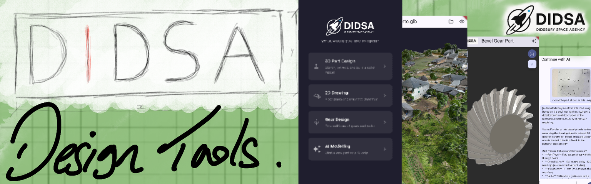
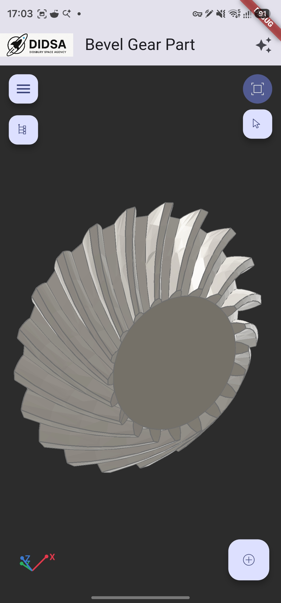
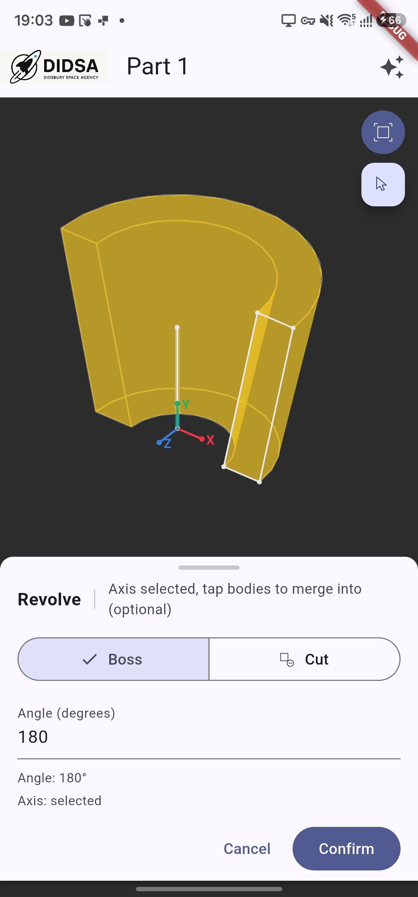

# DIDSA Design Tools

**A free, open-source, self-hosted parametric CAD app for Windows, Android and iOS.**

DIDSA Design Tools puts a real parametric CAD system — sketching, solid modelling, gears, and AI-assisted modelling — in one cross-platform app, backed by a lightweight server you can run on a Raspberry Pi, a spare PC, or even the Android phone the app is running on. It's built by [DIDSA (Didsbury Space Agency)](https://didsa.uk/didsa-design-tools/) as a personal education/interest project that's grown into something genuinely useful, and it's free for anyone with an idea to use, learn from, and build on.

> Built with AI assistance, guided by over a decade of hands-on engineering-software and design-tool experience.

---

## ⚠️ Pre-release status

DIDSA Design Tools is under active development. The backend carries an extensive automated test suite (2,000+ tests, run on every change), but real-device testing is not exhaustive — some features are confirmed on real hardware, others only against automated tests, and iOS has had zero testing so far. More testing across more devices is needed.

If you try it, **a clear reproduction is the single most useful thing you can send us** — see [Contributing](#contributing--feedback).

---

## What is DIDSA?

DIDSA (Didsbury Space Agency) is a hobby engineering project turned open-source software effort, built for **makers and hobbyists** who want real parametric CAD without a subscription, a cloud account, or a desktop tied down to one location. Think of it as a free, self-hosted answer to reaching for Fusion 360, FreeCAD or OnShape when what you actually want is to design a bracket, a gear, or a 3D-printable part **from your Android phone**, on your own hardware.

The toolset is **maker-focused with professional capabilities**: intuitive enough to pick up as a beginner, but built on the same kind of parametric, feature-tree modelling that professional CAD packages use — sketches with a real geometric constraint solver, a dependency graph that recomputes downstream features automatically, and export to standard interchange formats.

Everything lives in **one app**. There's no separate sketching tool, gear calculator, or AI plug-in to install — 3D modelling, 2D drawing, gear design and AI-assisted modelling are all modules inside the same client, talking to the same self-hosted backend.

## Modules

### 🧩 3D Part Design
Sketch on any of the fixed reference planes with a real 2D geometric constraint solver ([`py-slvs`](https://github.com/realthunder/solvespace), distance constraints today, more planned), then build solids with:

- Extrude, Revolve, Sweep and Loft (boss/cut)
- Fillet and Chamfer
- Pattern (linear/circular) and Mirror
- Boolean operations, Shell, Move/Scale Body, Move/Delete Face
- Measure and Section tools

Import/export **STEP, STL, OBJ and glTF** for interoperability with other CAD tools, 3D printing, and visualization. Scoped for addition next: thin features and more direct-editing operations — see [`docs/roadmap.md`](docs/roadmap.md).

### ✏️ 2D Drawing
A simple, in-app environment for sketches, layouts and basic technical drawings — no separate drawing package required. Currently focused on basic 2D sketching; DXF import/export, layers, dimensions and a more complete parametric drawing environment are in active development (`docs/dxf-io/`). A longer-term goal is turning hand sketches and reference photos into usable 2D CAD geometry.

### ⚙️ Gear Design
Define the gear you need and get a complete, ready-to-use 3D model — no manual involute-curve construction required. Once generated, a gear is a normal editable part, so you can add holes, keyways, bosses and other features on top of it.

Supports **external & internal spur, helical, herringbone, rack-and-pinion, bevel, bevel pair, spiral bevel, crown, planetary gear sets and gear chains** — with real gear geometry (not approximated) and models designed to work well as 3D prints or inside a larger assembly.

### 🤖 AI-Assisted Design (text-to-CAD, voice-to-CAD, photo-to-CAD)
The most experimental module, and deliberately shipped early so the community can help shape it. Describe a part by **text, voice, or a photo of a hand sketch or engineering drawing**, and an LLM turns it into a real, editable feature-tree part via the app's own Sketch/Feature API — not a black-box mesh generator. It runs against your choice of AI provider (local or cloud, OpenAI-compatible or Anthropic).

The designer stays in control throughout: the AI proposes a structured plan through the same API a human uses, so every result is inspectable, editable, and built from ordinary features. Gear-shaped requests hand off to the Gear Design module rather than being freeformed.

## In active development

- **Assemblies** — multi-part assemblies in the same file type and viewport as part modelling, with an assembly tree, mates (coincident/concentric/parallel/distance/angle), and a "focus" mode to edit a part in the context of the assembly around it. The data model, storage layer, and initial focus-stack UI are already built on a feature branch; mate solving reuses the constraint solver already powering Sketch. Not yet merged to `main`.

## Future ideas

- VR design review and manipulation
- Stress analysis
- Precise root-cause diagnosis for over-constrained sketches (rather than today's "blame the newest constraint" convention)
- Whatever the community asks for next — since this is open source, feature requests and contributions genuinely steer the roadmap. See [`docs/roadmap.md`](docs/roadmap.md) for the current in-flight list and [`docs/didsa-longterm-vision-and-model.md`](docs/didsa-longterm-vision-and-model.md) for the long-horizon thinking behind it.

## Hardware requirements

DIDSA Design Tools is a thin client talking to a self-hosted backend — the backend does the geometry kernel work, the client holds and displays the model. It does **not** persist any data between sessions; your device is always the source of truth for your files.

| Component | What's confirmed working | Notes |
|---|---|---|
| **Backend server** | Raspberry Pi 5 (4GB, arm64) | Current production deployment; runs in Docker |
| | Any x86_64 machine (Docker) | Multi-arch images are built for exactly this migration path |
| | An Android phone itself, via Termux | The backend runs directly under Termux/proot Debian on-device — no separate server needed at all |
| **Client app** | Android, Windows | Built and tested on real devices, including a phone with a fold-out mouse/trackpad workflow |
| | iOS | Builds via the same Flutter codebase; zero on-device testing so far |

## Software requirements

**Backend** — one of:
- Docker (recommended) — build the multi-arch image from `backend/` and run it with a `CAD_API_KEY` environment variable set (see `backend/`)
- [Termux](https://termux.dev/) + a Debian proot on an Android device, running the same Python/FastAPI stack directly — genuinely self-contained, no network dependency, and this is a real verified deployment target, not a hypothetical one

**Client**:
- A pre-built app for your platform, or
- [Flutter](https://flutter.dev/) 3.6+ to build `client/` yourself for Windows, Android or iOS

The client and server talk over HTTPS with a single static API key (`X-API-Key` header) — a security posture suitable for a personal/hobby deployment kept off the open internet, not a multi-tenant auth system. See `backend/app/auth.py` and [`docs/project-brief.md`](docs/project-brief.md) for the honest details.

## Architecture, in brief

- **Stateless backend**: the client holds the authoritative model (as a native JSON file on-device) and sends it to the server for recompute, meshing, or STEP/STL export. There's nothing to migrate or lose server-side, and nothing to back up but your own files.
- **Modular by design**: each capability (Sketch, Extrude, Gear, AI Modelling, …) is an independent module behind a shared dependency graph, so new features slot in without reworking existing ones.
- **True parametric history**: editing an upstream sketch dimension marks downstream features dirty and recomputes them automatically — this is what makes it CAD rather than a 3D viewer.

Full technical detail lives in [`docs/project-brief.md`](docs/project-brief.md) (original architecture spec), [`docs/roadmap.md`](docs/roadmap.md) (open work), and [`docs/status.md`](docs/status.md) (complete build history).

## Built on

DIDSA Design Tools stands on the shoulders of some excellent open-source projects:

- **[Open CASCADE Technology (OCCT)](https://dev.opencascade.org/)** via **[pythonocc-core](https://github.com/tpaviot/pythonocc-core)** — the geometry kernel doing every real solid-modelling operation
- **[SolveSpace](https://github.com/solvespace/solvespace)** (via the [`realthunder`](https://github.com/realthunder/solvespace) fork used by FreeCAD's Assembly3 workbench) and its Python bindings, **[`py-slvs`](https://pypi.org/project/py-slvs/)** — the 2D/3D geometric constraint solver behind sketching (and, soon, assembly mates)
- **[FastAPI](https://fastapi.tiangolo.com/)** — the backend API layer
- **[Flutter](https://flutter.dev/)** and **[`flutter_scene`](https://pub.dev/packages/flutter_scene)** — the cross-platform client and its 3D viewport

Thank you to the maintainers and contributors of each of these — none of this exists without them.

## Contributing & feedback

This is open source, and the toolset's direction is genuinely shaped by what the community needs and reports:

- **Found a bug, or something confusing?** Open an issue — at this pre-release stage, real-world reports are the single most valuable contribution you can make.
- **Want a feature?** Open an issue describing what you're trying to build — the module list above grows based on what people are actually inspired to make.
- **Want to contribute code?** PRs are welcome; see [`docs/project-brief.md`](docs/project-brief.md) and [`docs/roadmap.md`](docs/roadmap.md) for the current architecture and in-flight work before diving in.

## FAQ

**Is there a free CAD app for Android?**
Yes — the DIDSA client runs natively on Android (and Windows and iOS), and the whole toolset, backend included, is free and open source under GPLv3.

**Can I run CAD software on my phone without a separate server?**
Yes. The backend can run directly on an Android device under Termux + a Debian proot — the phone is both the client and the server, with no network dependency.

**Is DIDSA a free alternative to Fusion 360, FreeCAD or OnShape?**
It's aimed at the same kind of work — parametric sketch-and-feature solid modelling, gears, STEP/STL export — from a maker/hobbyist angle rather than a professional one, and it's pre-release, so treat it as an actively-developing alternative rather than a drop-in replacement today.

**Does it have AI CAD generation (text-to-CAD)?**
Yes — the AI-Assisted Design module turns a text description, a voice note, or a photo of a sketch/drawing into a real, editable parametric part, not just a mesh.

**Can DIDSA design gears?**
Yes — external/internal spur, helical, herringbone, rack-and-pinion, bevel, spiral bevel, crown and planetary gear sets, generated as normal editable parts ready for 3D printing or assemblies.

**Is it ready for production use?**
No — see the Pre-release status note near the top of this page. It's genuinely usable today but still under active development, with testing coverage that isn't yet exhaustive across every device.

## License

Licensed under the [GNU General Public License v3.0](LICENSE) — free to use, study, modify and share, and it always will be.

## Learn more

- [didsa.uk/didsa-design-tools](https://didsa.uk/didsa-design-tools/) — the project's home page
- [`docs/project-brief.md`](docs/project-brief.md) — original architecture & module spec
- [`docs/roadmap.md`](docs/roadmap.md) — open work
- [`docs/status.md`](docs/status.md) — full build history
- [`docs/didsa-longterm-vision-and-model.md`](docs/didsa-longterm-vision-and-model.md) — long-horizon vision
- [`client/README.md`](client/README.md) — Flutter client details and verification status
